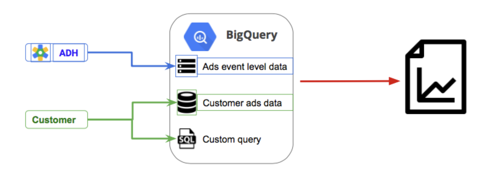

## Introduction: RIPS Internship

RIPS stands for Research in Industrial Projects for Students. It is an annual research program organised by the Institute of Pure and Applied Mathematics (IPAM) of UCLA. With an acceptance rate of 2-3%, it hosts every year 36 interns who work on 9 industrial projects in groups of 4. I was one of the interns selected for the year 2019 and this post describes my project and our work. This intern experience will be limited to the professional and work front. People and personal experience will be covered in a separate post.

## THE INTERNSHIP

RIPS is a crossover between research and industrial experience. We are given an industrial problem and have to solve it using quantitative and qualitative research. Each year witnesses industrial companies bringing their problems. I had a chance to work, with my fellow teammates, for Google, LA. 

## Problem Description

Google has an Ads Data Hub (ADH) for advertisers (customers) to analyze their ad campaigns 
<!-- (system diagram in figure 1).  -->
The advertisers can not see the raw data, for it can violate users' privacy. Hence advertisers can query the database to generate useful analytics. ADH has its own privacy filters so that advertisers only obtain aggregate results. Despite those filters, leaks can still occur. Our goal was to develop a framework that can measure the risk of privacy leaks in Google's ADH.

<!--  -->

<figure>
	
	<figcaption>Figure 1: High level overview of working of ADH</figcaption>
</figure>

## Conclusion

We provided Google, LA with the necessary deliverables, designing a framework that gives a risk assessment score descriptive of how at risk each user is and how each attribute contributes to the risk. We call it the PIRATE Score (Probabilistic Identification Risk and Attacker Threat Estimate score). Paper for the same will soon be available.

Our report, results and outputs are available on request. Please mail at shreyagupta_btk216[at]dtu[dot]ac[dot]in

<!-- which did more than what I could imagine any internship to do. It gave me people, tech, good memories and some very important life skills and lessons. -->